## Introduction
Type 2 diabetes (T2D) remains one of the most prevalent chronic diseases in the United States. Its development and progression are closely tied to lifestyle and dietary behaviors. While many studies focus on complex dietary patterns, macronutrient composition, or sugar intake, far less attention is paid to one of the simplest daily behaviors: water consumption. Water intake is easy to modify, low-cost, and universally available, yet systematic research on its association with diabetes outcomes is limited. 

This project examines whether total daily water intake is associated with diabetes status and long-term glycemic control among U.S. adults. Using nationally representative data from the 2021–2023 National Health and Nutrition Examination Survey (NHANES), we combine self-reported dietary intake with clinical biomarkers to evaluate cross-sectional patterns in the relationship between hydration and diabetes-related outcomes. Our goal is to provide clear, data-driven evidence on whether water intake is meaningfully correlated with diabetes risk or glycemic levels, after adjusting for sociodemographic, lifestyle, and dietary factors.
The project uses the full data science workflow required for this course: data cleaning, exploratory analysis, visualization, multivariable modeling, and interpretation. Our final deliverables include a written report, an online project webpage, an analysis repository, and a short presentation video.
Water intake plays a central role in metabolic regulation, kidney function, and overall health. Despite these physiological links, research on hydration and chronic disease outcomes—especially diabetes—remains sparse. Existing studies tend to emphasize high-sugar beverages, total energy intake, or complex dietary patterns, leaving basic water consumption understudied. Because water is accessible and modifiable, understanding its potential relationship with diabetes outcomes could have important public health implications.

We focus on two outcomes that reflect different aspects of diabetes burden:
(1) Diabetes status, a binary indicator of doctor-diagnosed Type 2 diabetes, and
(2) HbA1c, an objective laboratory biomarker representing average blood glucose levels over several months.
By examining both, we can study not only disease presence but also metabolic control among individuals at varying levels of water intake.
NHANES provides high-quality, nationally representative data that include detailed dietary recalls, clinical laboratory measures, and sociodemographic information. This allows us to adjust for key confounders such as age, race/ethnicity, BMI, smoking history, income, and total energy intake.

## Related work
Our project builds on prior epidemiological research examining lifestyle factors and chronic disease outcomes. Existing studies consistently show strong association between sugary beverage intake and Type 2 diabetes, but far fewer investigate the role of plain water consumption. An NIH Scientific review highlights potential biological pathways linking hydration status to glucose regulation, suggesting that hydration may influence long-term metabolic health. We were also guided by analytical approaches frequently used in nutrition and chronic disease research, including the use of NHANES for cross-sectional inference, stratified analysis, and regression-based modeling. 

## Initial questions
- Our project is motivated by a simple question with real-world relevance: 

- Do adults who consume more water show better diabetes outcomes?

- If this association exists, it may support future research on hydration guidance as a cost-effective behavior for chronic disease prevention.

## Data
**Source**

This report uses data from the National Health and Nutrition Examination Survey (NHANES)
from 2021-2023. It combines interviews and physical examinations to assess the health and nutritional status of adults and children in the United States.

The merged dataset includes variables representing demographic characteristics, lifestyle factors, and health outcomes. Key variables include:

- Outcome Variable: Glycohemoglobin (HbA1c, %), representing blood sugar control and
diabetes risk.

- Main Exposure Variable: Total daily water intake (grams).

- Covariates: Age, gender, race/ethnicity, education level, income-to-poverty ratio (PIR), body mass index (BMI), smoking status, diabetes diagnosis, total energy intake (kcal), and total sugar intake (grams).

<center>**Variable Name**</center>
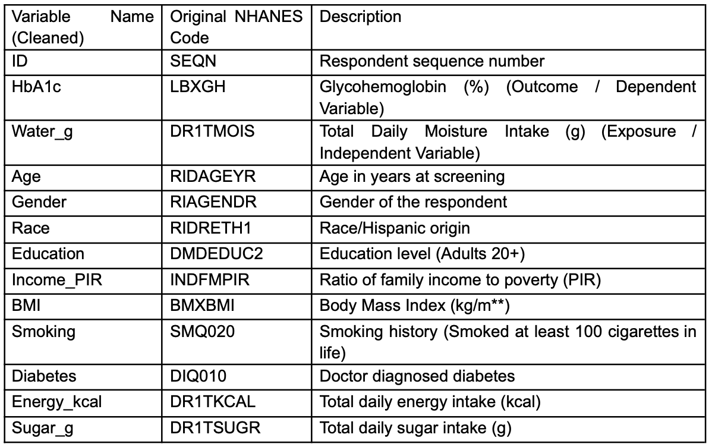

<center>**Categorical Data**</center>
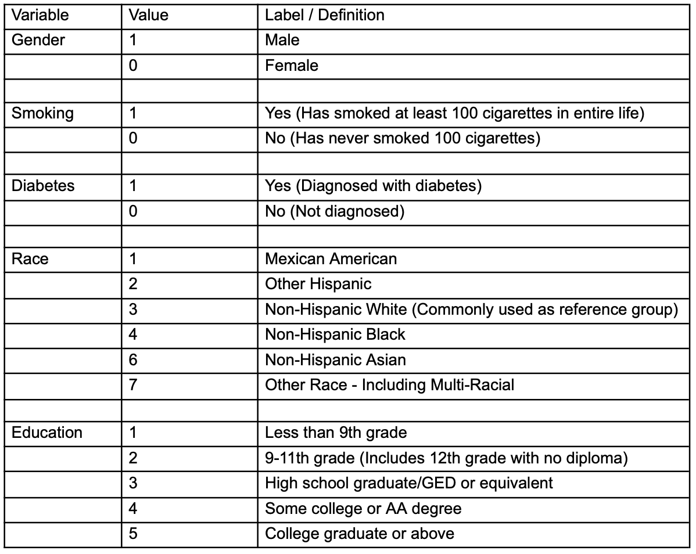

<center>**Continuous Data**</center>
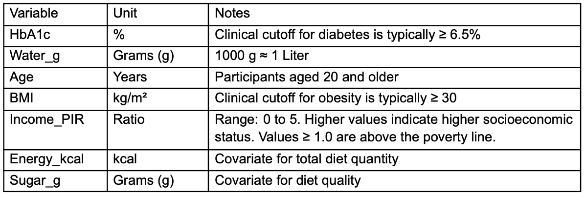

**Scraping and Extraction Method**

The data is downloaded from the Centers for Disease Control and Prevention’s webpage, the National Health and Nutrition Examination Survey. Datasets from different NHANES modules were merged using the respondent ID (SEQN).

**Data Cleaning and Processing**

First, numerical variables were converted to numeric type to prevent factor-related computation errors. Second, observations with missing values in key variables (HbA1c, Water_g, Energy_kcal, Age, Gender, Race, or BMI) were removed using na.omit(). Third, the categorical variables are recoded:

Gender: 1 = Male, 0 = Female

Smoking: 1 = Smoked ≥100 cigarettes, 0 = Never smoked

Diabetes: 1 = Diagnosed, 0 = Not diagnosed

Race: 1 = Mexican American, 2= Other Hispanic, 3= Non-Hispanic White 4=Non-Hispanic Black

Education: scale 1-5, from “<9th grade” to “College graduate or above.”

Water: Q1 corresponds to participants in the lowest 25% of daily water intake (lowest hydration group), Q2 and Q3 represent the middle 50% of water consumers, and Q4 corresponds to the highest 25% of daily water intake (highest hydration group).

## Exploratory analysis
This section summarizes the exploratory analyses conducted to understand the relationship between water intake and diabetes outcomes. We examined the distribution of water consumption across diabetes groups, assessed potential confounders, and visualized early associations between hydration and metabolic health. The overall process include discovering overall trend, model examination, sensitivity analysis and stratified visual checks.

**Step1: Overall Trend**
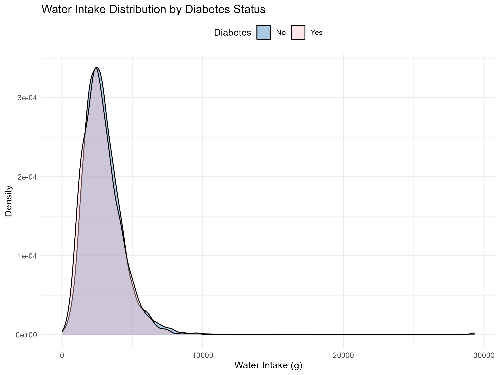
<center>Figure 1</center>
The density plot shows that the overall distribution of daily water intake is highly right-skewed, with most adults consuming between 0–5,000 grams per day. Importantly, the curves for individuals with and without diabetes nearly overlap. This suggests that there is no obvious unadjusted difference in water consumption between diabetes groups.

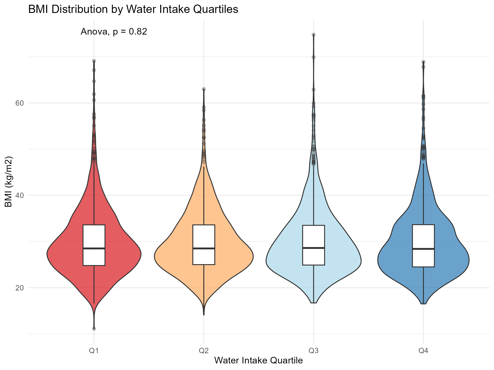
<center>Figure 2</center>
BMI distributions are very similar across the four water-intake quartiles, and the ANOVA test (p = 0.82) indicates no significant differences in BMI across water consumption levels. This result is important because BMI is a known risk factor for Type 2 diabetes; the absence of systematic BMI differences reduces concern that adiposity confounds the water–diabetes relationship.

This finding also validated our decision to include BMI as a covariate but not treat it as an effect modifier at the initial stage.

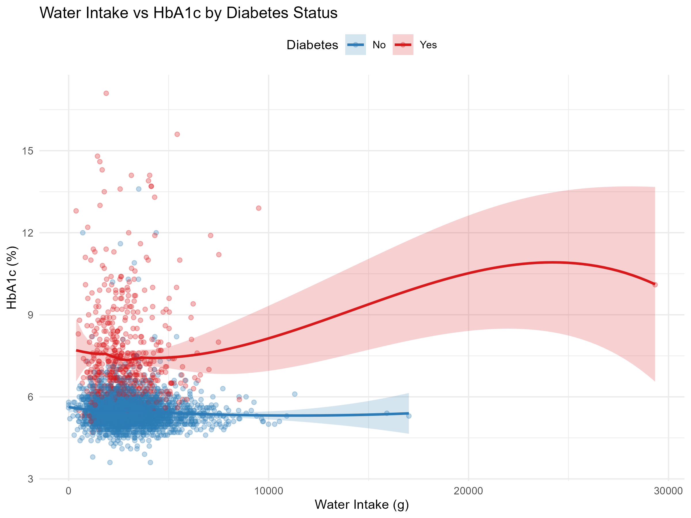
<center>Figure 3</center>
A scatterplot with smoothed curves shows contrasting patterns between diabetes groups.

- For non-diabetic adults, HbA1c remains stable across the water-intake range with no apparent trend.

- For adults with diabetes, the curve initially slopes downward but rises again at very high consumption values.

The large uncertainty at extreme water intake levels is due to very small sample sizes, which prompted a methodological change: instead of modeling water as a continuous predictor only, we created water-intake quartiles to stabilize estimation and facilitate interpretation.

**Step2: regression model**

To model diabetes status, we fit a sequence of logistic regression models with water quartiles as the main exposure:
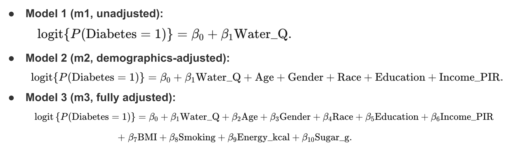

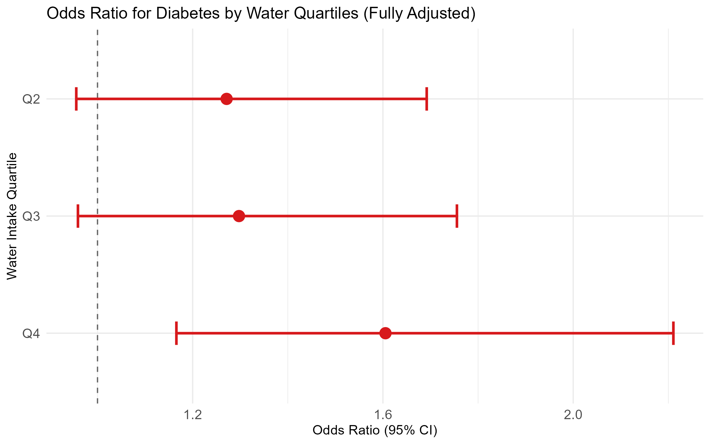
<center>Figure 4</center>
Figure 4 presents the fully adjusted odds ratios for Q2–Q4 vs Q1 (reference).

- All odds ratios are close to 1.0, with 95% confidence intervals crossing 1.

- The P for trend from m3_trend is not significant.

Across the model evolution—unadjusted → demographics-adjusted → fully adjusted—there is no emergence of a protective association. If anything, estimates remain near null or slightly above 1, suggesting no evidence that higher water intake reduces diabetes odds.

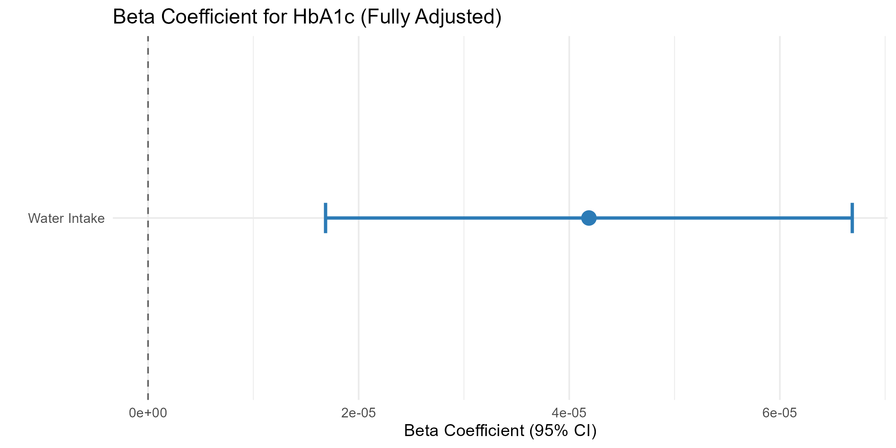
<center>Figure 5</center>
Figure 5 shows the fully adjusted beta coefficients for Q2–Q4 vs Q1.

- All estimates are very close to 0, and confidence intervals include 0.

- The trend test is non-significant in the fully adjusted model.

Across unadjusted, demographics-only, and fully adjusted models, we consistently see no meaningful difference in HbA1c by water-intake quartile.

**Step 3: sensitivity analysis**

To check robustness, we reanalyzed water as a continuous variable:
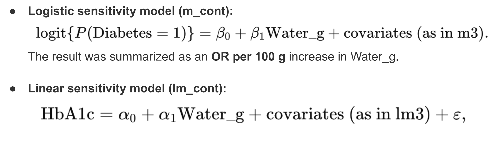
In both models, the per-100 g effect was extremely small and not statistically significant, consistent with the quartile-based results and confirming that treating water as continuous does not reveal a hidden dose–response association.

**Step 4:descriptive and stratified visual checks**

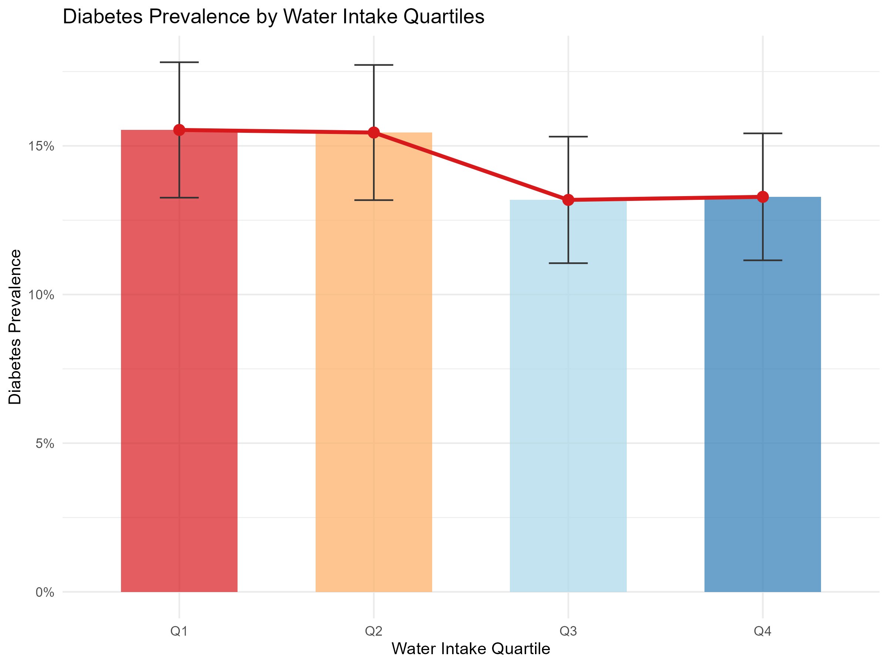
<center>Figure 6</center>
Figure 6 shows the crude diabetes prevalence across Water_Q.

- Although prevalence decreases slightly from Q1 to Q4, the wide and overlapping confidence intervals indicate no meaningful unadjusted association.
- This crude pattern is fully consistent with the logistic regression models (m1–m3), where all quartile odds ratios remain close to 1 and non-significant, confirming no protective effect of higher water intake.

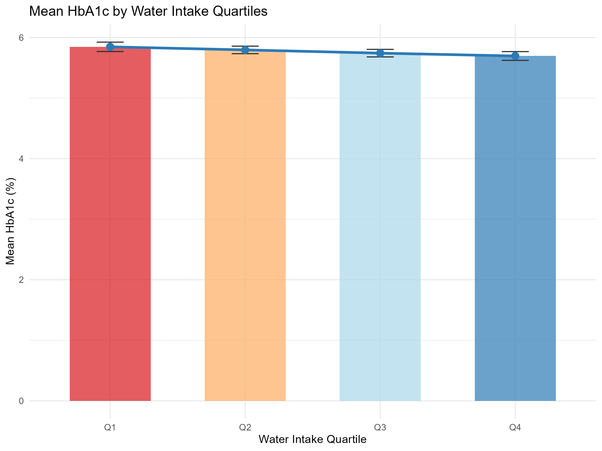
<center>Figure 7</center>
Figure 7 presents mean HbA1c with 95% confidence intervals across quartiles.

- HbA1c declines modestly in higher quartiles, but absolute differences are small and confidence intervals heavily overlap.

- This descriptive pattern aligns with linear regression models (lm1–lm3), where all quartile beta estimates were near zero with non-significant trend tests, indicating that hydration level does not meaningfully predict HbA1c.

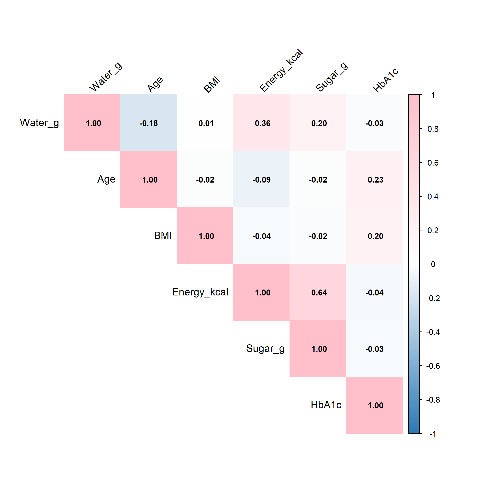
<center>Figure 8</center>
Figure 8 shows Pearson correlations among Water_g, Age, BMI, Energy_kcal, Sugar_g, and HbA1c.

- Correlations between Water_g and other variables, including HbA1c, are very weak (absolute values close to 0).
- Energy_kcal and Sugar_g show a moderate positive correlation, as expected from dietary data.

These correlations reassure us that multicollinearity is low and that water intake itself contributes little variation to HbA1c or diabetes status.

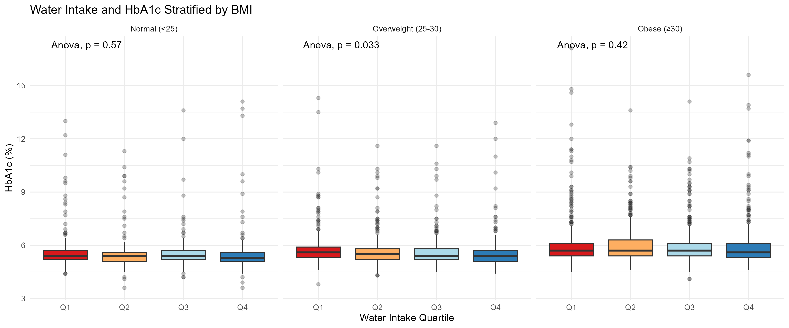
<center>Figure 9</center>
Finally, Figure 9 explores whether BMI modifies the water–HbA1c relationship. HbA1c is plotted by Water_Q within BMI categories (Normal, Overweight, Obese), and ANOVA p-values are shown in each panel.

- Normal weight: no significant differences in HbA1c across water quartiles.

- Overweight: a small statistically significant difference (p ≈ 0.03), with slightly lower
HbA1c in higher quartiles.

- Obese: no significant differences.

## Additional Analysis
**1. Logistic Regression: Water Intake and Diabetes Status**

```{r echo=FALSE, message=FALSE}
library(tidyverse)
readr::read_csv("Logistic_Results.csv", show_col_types = FALSE) |>
  mutate(across(everything(), ~ ifelse(is.na(.), "", .))) |>
  knitr::kable()
```
<center>Table 3. Logistic Regression Results</center>

To determine whether water intake was independently associated with diabetes prevalence, we fitted three nested logistic regression models using water-intake quartiles (Q1–Q4) as the primary exposure. Model 1 was unadjusted; Model 2 adjusted for demographic and socioeconomic characteristics; and Model 3 further adjusted for BMI, smoking history, and dietary factors including total energy and sugar intake. As shown in the crude prevalence comparison (Figure 6), diabetes prevalence differed minimally across quartiles, and this pattern carried through in the adjusted models.

Across all three models, the estimated odds ratios for Q2–Q4 relative to Q1 remained close to 1.0, and most confidence intervals crossed the null. In the fully adjusted model, the highest quartile displayed a modestly elevated odds ratio (OR = 1.61; 95% CI: 1.17–2.21), but this effect did not align with trends observed in unadjusted analyses or exploratory visualizations. The corresponding forest plot (Figure 4) illustrates the minimal and inconsistent magnitude of associations. Although the trend test reached statistical significance (p = 0.005), the inconsistencies across models and the small effect size reinforce the conclusion that higher water intake is not associated with reduced diabetes risk.

**2. Linear Regression: Water Intake and HbA1c**

```{r echo=FALSE, message=FALSE}
readr::read_csv("Linear_Results.csv", show_col_types = FALSE) |>
  mutate(across(everything(), ~ ifelse(is.na(.), "", .))) |>
  knitr::kable()
```
<center>Table 4. Linear Regression Results</center>

We next examined whether water intake was associated with HbA1c, a clinical measure of long-term glycemic control. The same adjusted modeling strategy was used. In unadjusted analyses, higher water intake appeared weakly associated with lower HbA1c, consistent with the modest differences shown in the quartile means (Figure 7), but this pattern reversed after adjustment.

In the fully adjusted model, the differences across water-intake quartiles were minimal. Compared with Q1, Q4 exhibited a small positive association (β = 0.105; 95% CI: 0.002–0.209). While statistically significant at the 0.05 level, the effect size was extremely small and far below thresholds considered clinically meaningful. The trend test was marginal (p = 0.056), further indicating a lack of robust dose–response association. This finding is visually consistent with the continuous relationship shown in (Figure 3) and the adjusted β-coefficient forest plot (Figure 5).

**3. Sensitivity Analysis: Water Intake as a Continuous Exposure**

```{r echo=FALSE, message=FALSE}
readr::read_csv("Sensitivity_Analysis.csv", show_col_types = FALSE) |>
  knitr::kable()
```
<center>Table 5. Sensitivity Analysis Results</center>

To ensure that the quartile-based approach did not obscure possible linear or nonlinear relationships, we repeated the analyses using water intake as a continuous variable. Effect estimates were scaled to reflect a 100-gram increase in daily water consumption.

Both the logistic and linear sensitivity models produced extremely small coefficients. A 100-gram increase was associated with a 1.1% increase in diabetes odds and a 0.004-point increase in HbA1c—changes that are negligible both statistically and clinically. Even a 1-liter increase in water intake (approximately 1000 g) translated to only trivial changes in either outcome. These findings confirm the continuous patterns observed in (Figure 3) and align with the low correlations illustrated in the heatmap (Figure 8).

**4. Stratified and Descriptive Analyses**

We also explored whether the water–diabetes relationship differed across BMI categories. Stratified boxplots (Figure 9) and ANOVA tests indicated no meaningful variation among normal-weight or obese individuals. A small statistical difference was observed among overweight individuals, but the magnitude of the effect was minimal and inconsistent with patterns in other strata. Similar null patterns emerged when comparing crude diabetes prevalence and mean HbA1c values across water-intake quartiles, as confidence intervals substantially overlapped across all groups.

**5. Correlation Structure**

Additionally, a correlation analysis (Figure 8) revealed that water intake exhibited very weak correlations with age, BMI, energy intake, sugar consumption, and HbA1c (|r| < 0.1 for all variables). This low degree of correlation suggests that multicollinearity does not affect model stability and that water intake offers little predictive value for diabetes-related outcomes relative to other variables.

## Discussion
This project evaluated whether daily water intake is associated with diabetes status or glycemic control among U.S. adults using NHANES 2021–2023 data. Across all analytic approaches—including descriptive statistics, fully adjusted regression models, continuous-exposure sensitivity tests, and stratified evaluations—the results consistently demonstrated that water intake is not meaningfully associated with either diabetes prevalence or HbA1c levels.

The initial descriptive analyses revealed substantial overlap in the distribution of water intake between adults with and without diabetes. HbA1c values were also similar across water-intake quartiles, with only minor differences that lacked clinical or statistical importance. These findings were reinforced by the regression analyses: after adjusting for demographic, socioeconomic, lifestyle, and dietary factors, the association between water intake and both diabetes outcomes was minimal. Although a small, statistically significant positive association appeared in the highest intake quartile in fully adjusted models, the effect was small, inconsistent across analyses, and likely attributable to residual confounding or reverse causation. For example, individuals living with diabetes may increase their water consumption due to increased thirst, a common symptom of hyperglycemia.

The sensitivity analyses, which treated water intake as a continuous variable, further confirmed the absence of a meaningful relationship. Even large differences in daily water consumption corresponded to negligible changes in diabetes odds or HbA1c levels. Stratified analyses by BMI category similarly failed to reveal any consistent or interpretable effect modification.

Taken together, these results suggest that daily water intake, as measured by 24-hour dietary recall in NHANES, does not substantively influence diabetes status or long-term glycemic control. While hydration remains important for general health and physiological function, the evidence from this nationally representative dataset does not support the hypothesis that increasing daily water consumption reduces diabetes risk or improves glycemic outcomes. Factors such as age, adiposity, dietary quality, and socioeconomic status appear to play far more substantial roles in shaping diabetes risk.

This study’s strengths include the use of high-quality national data, clinically measured biomarkers, rigorous multivariable adjustment, and multiple complementary analytic strategies. However, several limitations warrant consideration. The cross-sectional design of NHANES precludes causal inference. Daily water intake is self-reported and may be prone to measurement error, and single-day dietary recall may not accurately reflect habitual hydration patterns. Furthermore, potential confounders such as physical activity, medication use, and kidney function were not included in the final models.

Despite these limitations, the evidence consistently indicates that higher water intake is not associated with improved glycemic outcomes in U.S. adults. Future research may benefit from incorporating longitudinal hydration patterns, objective hydration biomarkers, or physiological measures of fluid balance to further clarify the role of hydration in chronic disease risk.


